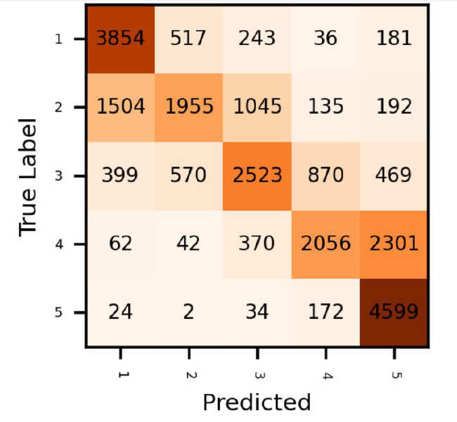
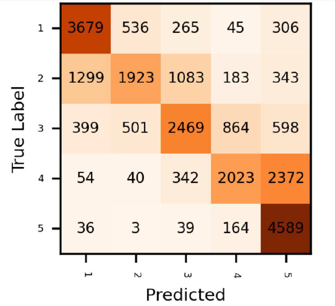

# NLP (Amazon Review Classifier) - Pytorch

-The folder contains a Python notebook file which can be run in Google Colab.

-Amazon review lines were classified as rating scores between 1-5.

-The models implemented were
  - LogReg
  - Self Attention with LSTM, BiLSTM, GRU, RNN.
  
  
  
  

  
  
  - BERT models (RoBERTa and DistilBERT)

Amazon reviews were summarized using the following model
  - Seq2Seq encoder-decoder
  
  
  
  
## Results (Confusion Matrices)
  
  
  Self Attention Model
  
  
  

  
  RoBERTa 
  
  
  

  
  
  DistilBERT
  
  
   

  
  

  
  
