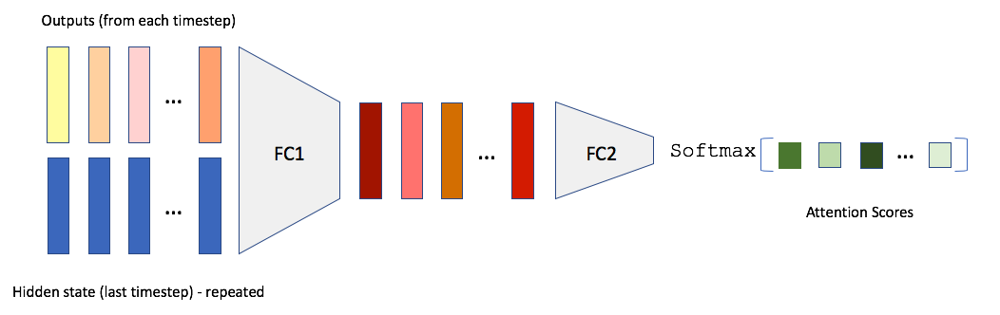
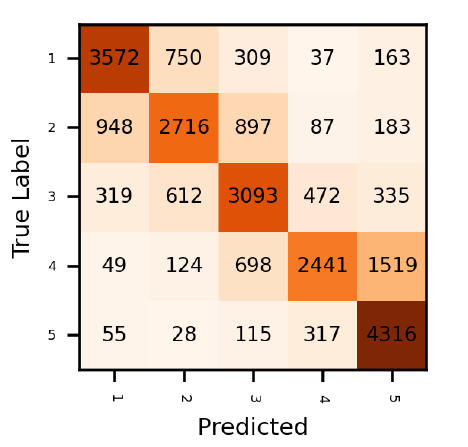
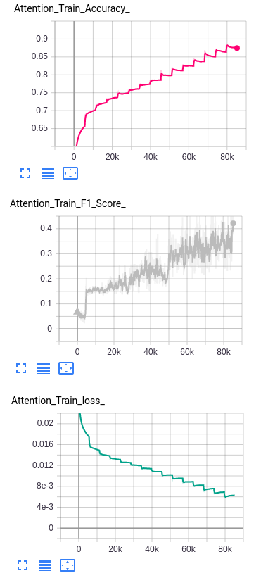

# Amazon Review Classifier -Pytorch

-The folder contains a Python notebook file which can be run in Google Colab.

-Amazon review lines were classified as rating scores between 1-5.

-The models implemented were
  - LogReg
  - Self Attention with LSTM, BiLSTM, GRU, RNN
  
  
  
  
  
  

  
  
  - BERT models (RoBERTa and DistilBERT)
  - Seq2Seq encoder-decoder model
  

  
  
